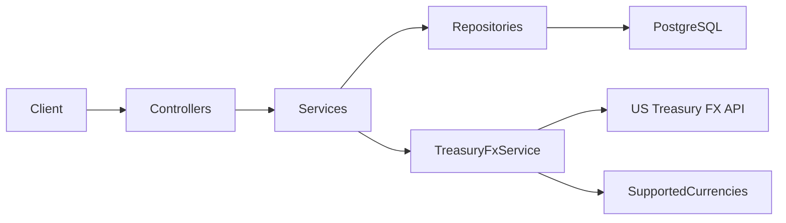

# Banking API

ASP.NET Core Web API for credit card management and transaction processing with live FX conversion via the [US Treasury Reporting Rates of Exchange API](https://api.fiscaldata.treasury.gov/services/api/fiscal_service/v1/accounting/od/rates_of_exchange).

**.NET 10** · **PostgreSQL** (Docker) · **Entity Framework Core**

---

## Quick Start

```bash
docker-compose up -d
cd BankingApi
dotnet run
```

- API: `http://localhost:5184` (or `https://localhost:7132`)
- Swagger: `/swagger`
- Tests: `dotnet test` (28 tests, no Docker required)

**Prerequisites:** [.NET 10 SDK](https://dotnet.microsoft.com/download), [Docker Desktop](https://www.docker.com/products/docker-desktop)

---

## Endpoints

| Req | Method | Path |
|---|---|---|
| 1 | `POST` | `/api/cards` |
| 2 | `POST` | `/api/cards/{cardId}/transactions` |
| 3 | `GET` | `/api/cards/{cardId}/transactions/{transactionId}?currency=AUD` |
| 4 | `GET` | `/api/cards/{cardId}/balance?currency=AUD` |

Currencies use **ISO 4217 codes** (`AUD`, `EUR`, `USD`). See Swagger for full request/response schemas.

---

## Architecture



| Layer | Key files | Purpose |
|---|---|---|
| **Controllers** | `CardsController`, `TransactionsController` | HTTP routing and status codes |
| **Services** | `CardService`, `TransactionService` | Business logic (Req 1–4) |
| **Adapter** | `TreasuryFxService` | Calls Treasury API behind `IFxService` |
| **Repositories** | `CardRepository`, `TransactionRepository` | EF Core data access |
| **Domain** | `Card`, `Transaction` | Core entities |
| **Currency** | `SupportedCurrencies` | ISO → Treasury name mapping + validation |

**Patterns:** Repository, Adapter (Treasury FX), Facade (services), DTOs, DI via `Program.cs`.

---

## Currency Design

Clients send ISO codes (`AUD`, `EUR`). The Treasury API uses its own names internally (`Australia-Dollar`). `SupportedCurrencies.cs` maps between them.

In WEX/eNett, currencies live in a cached database because many services share them. For this assessment, a small in-memory mapping is enough — the API stays ISO-friendly while Treasury-specific names stay behind the adapter.

- **Supported:** USD + AUD, EUR, GBP, CAD, JPY, NZD, CHF, SGD, HKD, MXN, CNY, KRW, BRL, INR, SEK, NOK, DKK, THB, MYR
- **Invalid code** (e.g. `ABC`) → `400 Bad Request`
- **No FX rate available** → `422 Unprocessable Entity`

---

## Key Assumptions

- Transactions stored in their original currency; balance/conversion uses FX
- No credit limit check on transaction creation (balance can go negative)
- Req 3 uses **historical** rates (on/before tx date, 6-month window); Req 4 uses **latest** rates
- FX fetched live per request (production would cache — rates change quarterly)
- Schema via `EnsureCreated()` on startup (production would use EF migrations)
