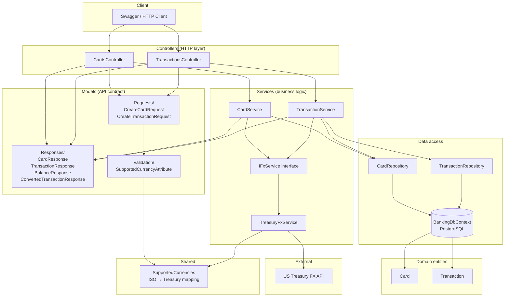

# Banking API

A C# ASP.NET Core Web API for credit card management and transaction processing with live currency conversion via the US Treasury Reporting Rates of Exchange API.

Built with **.NET 10**, **PostgreSQL** (via Docker), and **Entity Framework Core**.

---

## Requirements Coverage

| Requirement | Endpoint |
|---|---|
| Req 1 — Create a card with a credit limit | `POST /api/cards` |
| Req 2 — Store a purchase transaction | `POST /api/cards/{cardId}/transactions` |
| Req 3 — Retrieve transaction in specified currency | `GET /api/cards/{cardId}/transactions/{transactionId}?currency=AUD` |
| Req 4 — Retrieve available balance in specified currency | `GET /api/cards/{cardId}/balance?currency=AUD` |

---

## Prerequisites

- [.NET 10 SDK](https://dotnet.microsoft.com/download)
- [Docker Desktop](https://www.docker.com/products/docker-desktop)

---

## Running the Application

**Step 1 — Start PostgreSQL via Docker:**

```bash
docker-compose up -d
```

**Step 2 — Run the API:**

```bash
cd BankingApi
dotnet run
```

The API starts on `http://localhost:5184` (http profile) or `https://localhost:7132` (https profile). Swagger UI is at: `/swagger`

---

## Running the Tests

Tests run without Docker — unit tests use Moq, integration tests use an in-memory SQLite database.

```bash
dotnet test
```

Expected output: **25 tests, 0 failures**

- `BankingApi.Tests/Services/` — unit tests (CardService + TransactionService)
- `BankingApi.Tests/Integration/` — integration tests (full HTTP round-trip via WebApplicationFactory)

---

## Architecture Overview

### How the layers talk to each other



### Request flow examples

**Create a transaction (Req 2):**

```
Client → TransactionsController → CreateTransactionRequest validation
       → TransactionService → SupportedCurrencies.Validate("AUD")
       → CardRepository (card exists?) → TransactionRepository (save)
       → TransactionResponse ← 201 Created
```

**Get balance in AUD (Req 4):**

```
Client → CardsController → CardService.GetBalanceAsync(cardId, "AUD")
       → CardRepository (load card + transactions)
       → SupportedCurrencies.Validate("AUD")
       → TreasuryFxService.GetLatestRateAsync (per currency pair, cached in-request)
       → US Treasury API
       → BalanceResponse ← 200 OK
```

**Get converted transaction (Req 3):**

```
Client → TransactionsController → TransactionService.GetConvertedTransactionAsync
       → TreasuryFxService.GetHistoricalRateAsync (rate on/before tx date, 6-month window)
       → ConvertedTransactionResponse ← 200 OK or 422 if no rate
```

### Project structure — what each file/folder means

```
banking-api/
├── BankingApi/                        # Main Web API project
│   ├── Program.cs                     # App startup: DI wiring, DB init, middleware
│   ├── appsettings.json               # Connection string, Treasury API base URL
│   ├── Properties/launchSettings.json # Local dev ports and ASPNETCORE_ENVIRONMENT
│   │
│   ├── Controllers/                   # HTTP layer — routes, status codes, no business logic
│   │   ├── CardsController.cs         # POST /api/cards, GET .../balance
│   │   └── TransactionsController.cs  # POST/GET .../transactions
│   │
│   ├── Models/
│   │   ├── Requests/                  # Incoming DTOs with validation attributes
│   │   └── Responses/                 # Outgoing DTOs (never expose domain entities directly)
│   │
│   ├── Validation/
│   │   └── SupportedCurrencyAttribute.cs  # Rejects unsupported ISO codes at model validation
│   │
│   ├── Currency/
│   │   └── SupportedCurrencies.cs     # ISO 4217 ↔ Treasury name mapping + validation
│   │
│   ├── Domain/                        # Pure entities — no EF/API dependencies
│   │   ├── Card.cs
│   │   └── Transaction.cs
│   │
│   ├── Data/
│   │   └── BankingDbContext.cs          # EF Core DbContext, table relationships
│   │
│   ├── Repositories/                  # Data access — hides EF Core from services
│   │   ├── Contracts/                 # ICardRepository, ITransactionRepository
│   │   ├── CardRepository.cs
│   │   └── TransactionRepository.cs
│   │
│   └── Services/                      # Business logic (Facade + Adapter)
│       ├── Contracts/                 # ICardService, ITransactionService, IFxService
│       ├── CardService.cs             # Req 1 + Req 4
│       ├── TransactionService.cs      # Req 2 + Req 3
│       └── TreasuryFxService.cs       # Adapter: ISO codes → Treasury API calls
│
├── BankingApi.Tests/
│   ├── Services/                      # Unit tests with Moq (no DB, no HTTP)
│   └── Integration/                   # Full HTTP tests via WebApplicationFactory + SQLite
│
├── docker-compose.yml                 # PostgreSQL container for local dev
└── README.md
```

### Design patterns

| Pattern | Where | Why |
|---|---|---|
| Repository | `ICardRepository`, `ITransactionRepository` | Decouples business logic from EF Core; enables mocking in tests |
| Adapter | `TreasuryFxService` → `IFxService` | Isolates external Treasury API; can be mocked without network calls |
| Facade | `CardService`, `TransactionService` | Hides orchestration complexity (repo + FX) from controllers |
| DTO | `Models/Requests`, `Models/Responses` | Separates API contract from domain entities |
| Dependency Injection | `Program.cs` | Wires all interfaces to implementations; enables testability |

---

## Currency Design

### API format: ISO 4217 codes

Clients pass standard ISO currency codes everywhere — in request bodies and query strings:

```
POST body:  { "currencyCode": "AUD" }
GET query:  ?currency=EUR
```

Supported codes: **USD** plus AUD, EUR, GBP, CAD, JPY, NZD, CHF, SGD, HKD, MXN, CNY, KRW, BRL, INR, SEK, NOK, DKK, THB, MYR.

Invalid codes (e.g. `"ABC"`) return **HTTP 400** at creation time, not later when fetching balance.

### Why not use Treasury names in the API?

The US Treasury API uses its own `country_currency_desc` format internally (e.g. `Australia-Dollar`, `Euro Zone-Euro`). That format is awkward for API consumers.

In WEX/eNett, currencies are reference data stored in the database and cached because many services depend on them. For this assessment, the application only needs to support the Treasury API's currencies, so a small in-memory ISO → Treasury mapping lives in `SupportedCurrencies.cs` and is shared by the FX adapter and request validation. That keeps the API using standard ISO currency codes while isolating the Treasury-specific names behind the adapter.

```
Client sends "AUD"  →  SupportedCurrencies  →  Treasury API filter: "Australia-Dollar"
```

---

## API Reference

### Requirement 1 — Create a Card

```http
POST /api/cards
Content-Type: application/json

{
  "creditLimit": 5000.00,
  "creditLimitCurrency": "AUD"
}
```

**Response 201:**
```json
{
  "id": "3fa85f64-5717-4562-b3fc-2c963f66afa6",
  "creditLimit": 5000.00,
  "creditLimitCurrency": "AUD",
  "createdAt": "2026-07-02T00:00:00Z"
}
```

---

### Requirement 2 — Store a Purchase Transaction

```http
POST /api/cards/{cardId}/transactions
Content-Type: application/json

{
  "description": "Amazon.com - online purchase",
  "transactionDate": "2026-06-15",
  "amount": 120.00,
  "currencyCode": "USD"
}
```

`amount` is stored in the transaction's original currency (`currencyCode`).

**Response 201:**
```json
{
  "id": "...",
  "cardId": "...",
  "description": "Amazon.com - online purchase",
  "transactionDate": "2026-06-15",
  "amount": 120.00,
  "currencyCode": "USD",
  "createdAt": "2026-07-02T00:00:00Z"
}
```

**Response 400 (unsupported currency):**
```json
{
  "message": "Currency 'ABC' is not supported. Use ISO 4217 codes (e.g. AUD, EUR, GBP, USD)."
}
```

---

### Requirement 3 — Retrieve Transaction in Specified Currency

```http
GET /api/cards/{cardId}/transactions/{transactionId}?currency=AUD
```

Uses the exchange rate active **on or before** the transaction date, within the prior 6 months. Returns `HTTP 422` if no rate is available within that window.

**Response 200:**
```json
{
  "id": "...",
  "description": "Amazon.com - online purchase",
  "transactionDate": "2026-06-15",
  "originalAmount": 120.00,
  "originalCurrency": "USD",
  "exchangeRate": 1.5432,
  "convertedAmount": 185.18,
  "currency": "AUD",
  "exchangeRateDate": "2026-03-31"
}
```

**Response 422 (no rate within 6 months):**
```json
{
  "message": "Transaction ... cannot be converted to 'AUD': no exchange rate available within 6 months on or before 2026-06-15."
}
```

---

### Requirement 4 — Retrieve Available Balance

```http
GET /api/cards/{cardId}/balance?currency=AUD
```

`availableBalance = creditLimit - sum(all transactions)`, each converted individually. Uses the **latest** available Treasury FX rate.

**Response 200:**
```json
{
  "cardId": "...",
  "creditLimit": 7716.00,
  "totalTransactions": 185.18,
  "availableBalance": 7530.82,
  "currency": "AUD"
}
```

---

## Assumptions

| # | Decision |
|---|---|
| A | **Transactions are stored in their original currency** (`currencyCode` on each transaction). Cards have a `creditLimitCurrency`. Balance and conversion aggregate across currencies via FX. |
| B | **API uses ISO 4217 codes** (`AUD`, `EUR`, `USD`). Treasury `country_currency_desc` names are mapped internally — clients never see them. |
| C | **No credit limit enforcement on transaction creation.** Requirement 2 says "accept and store" — available balance may go negative. |
| D | **Unsupported currencies return HTTP 400** at write time. Missing FX rates return **HTTP 422** on read/conversion endpoints. |
| E | **Schema is created via `EnsureCreated()`** on startup. A production system would use EF Core Migrations (`dotnet ef migrations add Initial`). |
| F | **FX rates are fetched live** from the Treasury API on each request. A production system would add a caching layer (`IMemoryCache` or Redis) given rates only change quarterly. |

---

## Treasury FX API

**Endpoint used:** `GET https://api.fiscaldata.treasury.gov/services/api/fiscal_service/v1/accounting/od/rates_of_exchange`

- Public API, no authentication required
- Rates published quarterly
- All rates expressed as **units of foreign currency per 1 USD**
- Filtered by `country_currency_desc` and `record_date` for each requirement
- Full Treasury currency list: `GET .../rates_of_exchange?fields=country_currency_desc&sort=country_currency_desc&page[size]=200`
